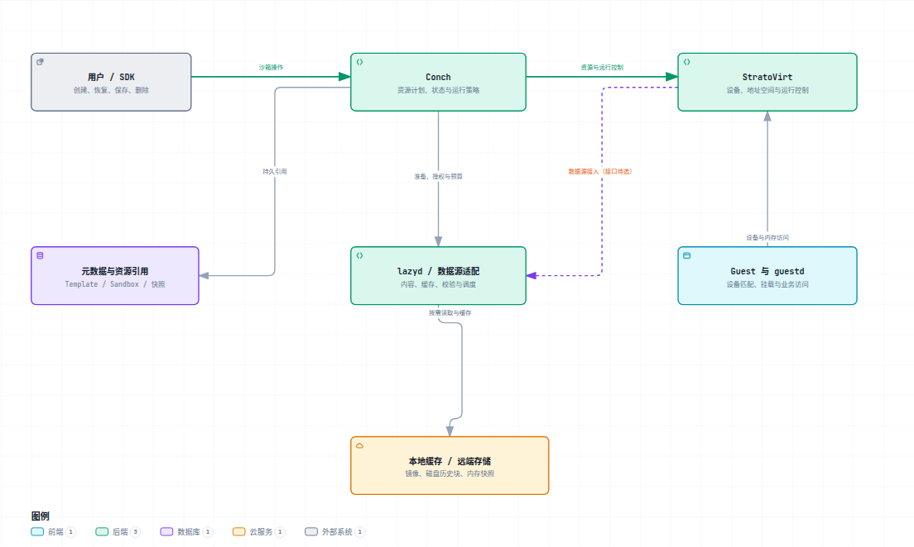
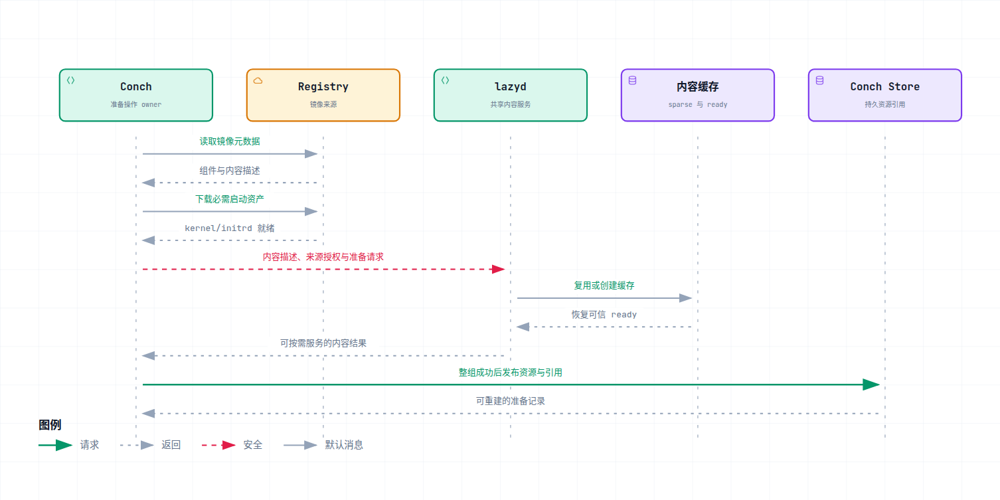
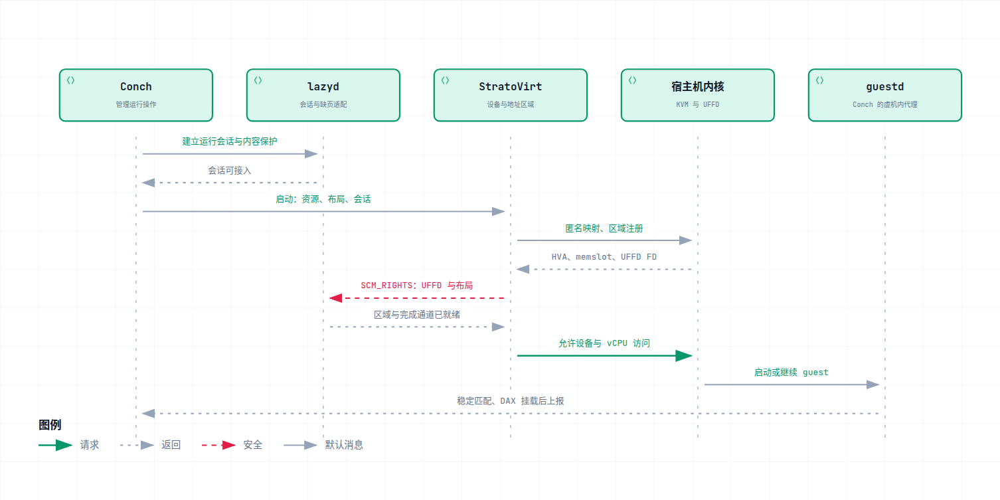
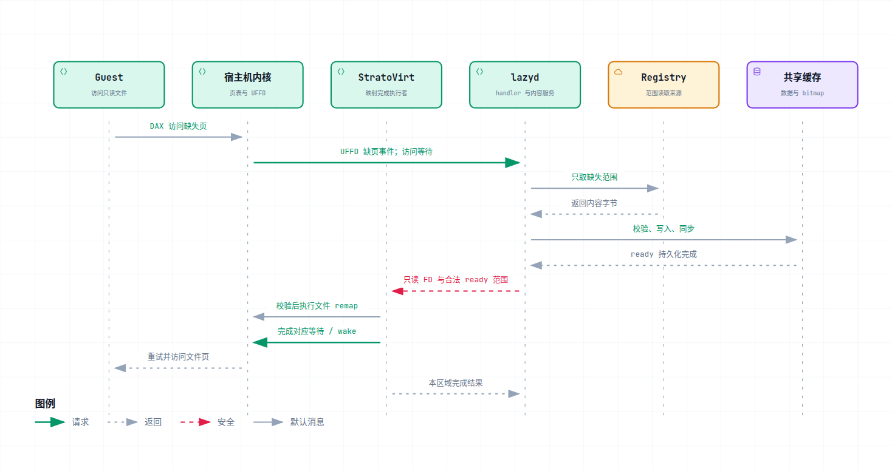
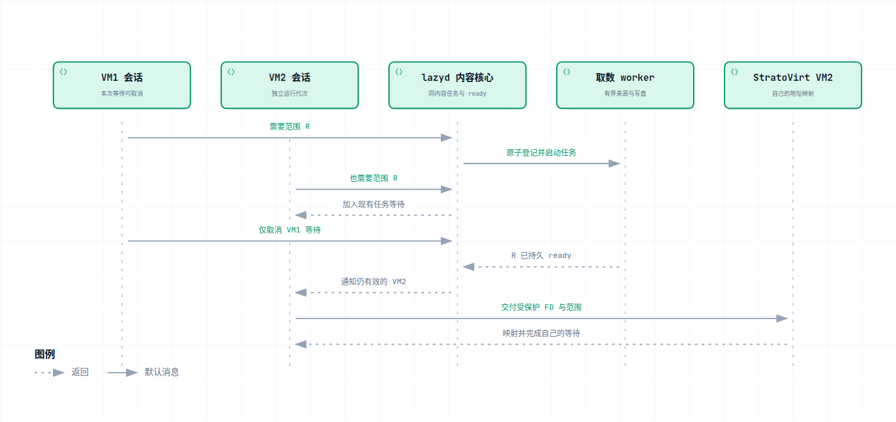
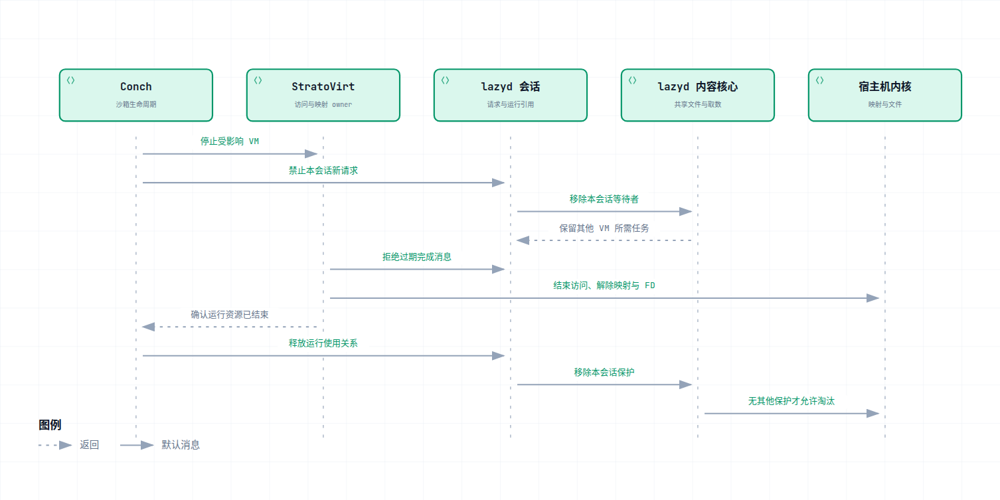
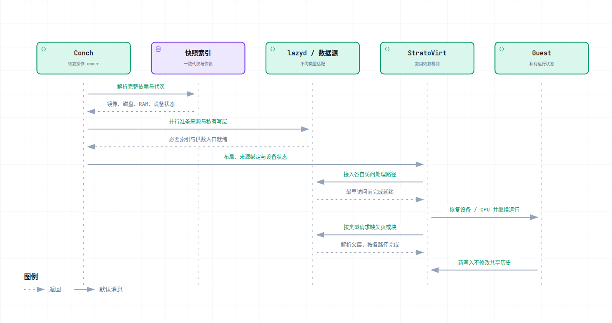

# Conch + lazyd + StratoVirt 懒加载整体候选方案

> 一篇连贯的方案：先看架构，再看三个仓库分别改什么，最后沿准备、启动、缺页、共享和快照恢复的时序理解完整系统。不要求先读完业界调研。

**这是完整候选的讲解，不是最终选型或已完成功能清单。** 范围为只读 EROFS + virtio-pmem/DAX。本文及图中用单 sparse 文件与 ready 索引（S1）、外部 handler（H2）串起三仓流程，便于理解；并不因此优先采用它们。缓存布局、持久提交、任务模型和 handler 的比较统一见[核心设计选型与验证计划](09-core-design-selection.md)。文中的实现步骤均在该候选成立时适用，CLI、JSON 和 socket 尚未冻结。

本文沿用已登记的源码核查结果，不宣称本次重新核查了最新上游。真正开工时，Conch、StratoVirt 从当时最新 upstream/dev 固定 commit；lazyd 根据目标职责重组。模块路径用于定位改动边界，不是要求保留现有结构不动。

## 阅读导航

- [1. 目标与架构](#architecture)：解决什么问题，三个项目怎样协作。
- [2. 数据与状态](#resources)：什么可以共享，什么必须属于单台 VM。
- [3. Conch 改什么](#conch)：镜像准备、资源计划、启动、guestd、生命周期。
- [4. lazyd 改什么](#lazyd)：内容服务、来源、共享任务、缓存、调度与会话。
- [5. StratoVirt 改什么](#stratovirt)：区域接入、UFFD、映射完成、只读与失败。
- [6. 三仓接口](#contracts)：跨仓传什么，成功分别意味着什么。
- [7. 冷启动时序](#cold-start)：从准备镜像到第一次读文件。
- [8. 多 VM 复用](#sharing)：共用下载和文件页，但分别完成映射。
- [9. 失败与关闭](#lifecycle)：请求怎样结束，缓存什么时候能回收。
- [10. 快照恢复](#checkpoint)：只读镜像、磁盘历史和 RAM 怎样衔接。
- [11. 性能与观测](#performance)：预取、网络策略和衡量标准。
- [12. 开发与验收](#delivery)：按什么顺序落地，哪些问题必须先验证。

<a id="architecture"></a>
## 1. 目标与架构

### 1.1 不是“提前返回”，而是“更早可用”

用户创建沙箱时，先准备足以启动的资产，不等整个 rootfs 下载完。虚机真正访问某段文件数据时，再从远端取得它；多台虚机使用相同内容时，共享下载、磁盘缓存和可能共享的干净文件页。

验收目标是**业务更早可用，内容正确，运行写入隔离，网络失败可结束，资源可回收**。仅仅让 pull 或 vCPU resume 提前完成，不能证明体验更好。

| 数据 | 当前设计 | 交付边界 |
| --- | --- | --- |
| 只读 rootfs | 原生 EROFS，通过 virtio-pmem 暴露，guest 使用 DAX 按需访问 | 首版主线 |
| kernel、initrd、必要配置和索引 | 沿用完整准备 | 首版保留 |
| 当前运行产生的文件修改 | 每个沙箱独立的可写层 | 不写回共享 EROFS |
| 已封存磁盘历史 | 后续增加远端按需来源，保留覆盖顺序和私有写层 | 快照阶段 |
| RAM 快照 | 复用 VMM 恢复能力，后续补远端按需来源 | 快照阶段；不等同于已有本地按需驻留 |

普通完整启动保持可用。当前不增加 fanotify 作为 guest pmem 触发入口，也不同时开发一套替代 pmem 的整盘块懒加载主线。后续磁盘历史块服务是快照的数据类型需求，不是首版路线扩张。

### 1.2 三仓联合设计，但职责不平均扩张



[打开可缩放架构图](assets/target-responsibilities.html)。这是角色图：Guest 在 VM 内，其余服务在宿主机；“本地缓存 / 远端存储”合并显示存储角色，不表示它们在同一位置。

**Conch 组织一次操作；lazyd 供应正确数据；StratoVirt 让虚机安全访问数据。**

| 组件 | 管理的核心问题 | 不承担的工作 |
| --- | --- | --- |
| Conch 宿主机侧 | 用哪些资源创建/恢复，何时就绪，失败后怎么收尾 | 不转发每次缺页，不替 VMM mmap |
| lazyd | 哪份内容、缺哪段、谁在下载、何时可读、谁还在使用 | 不管理 vCPU，不恢复 CPU/设备状态 |
| StratoVirt | 设备、地址空间、缺页接入、映射完成、运行控制 | 不解析 OCI、父层内容索引或调度预取 |
| guestd | 匹配 guest 设备、挂载文件系统、组装业务 rootfs | 不连接 registry，不管理宿主机缓存 |

guestd 属于 **Conch 仓库**，是虚机内的 agent，不是第四个独立产品。lazyd 内部的 handler、调度和缓存是逻辑模块，也不意味着新增三个进程。

控制面负责准备、绑定、就绪和释放；数据面负责缺失范围的读取与完成。Conch 不进入每次缺页的热路径，但必须能接收失败并改变沙箱状态。

### 1.3 文件、地址和物理页怎样对应

以下只表示 guest 通过 DAX 访问只读文件数据的路径，不是 guest 普通 RAM 的恢复路径：

```text
Guest 中的文件偏移
    -> EROFS/DAX 定位到 pmem 的设备偏移
    -> guest 虚拟地址 GVA -> pmem guest 物理地址 GPA
    -> KVM memslot 根据区域关系定位 StratoVirt 的 HVA
    -> 宿主机页表 / KVM 二阶段映射最终指向物理页 HPA

开始：HVA 已预留，但对应页没有所需内容，受 UFFD MISSING 管理
之后：StratoVirt 将 ready 文件范围映射到同一 HVA，访问文件缓存页
```

**memslot 不是页表。** 它描述 GPA 区域与 VMM 的 HVA 区域关系；CPU 实际地址翻译还涉及 guest 页表和 KVM 管理的二阶段映射。

DAX 绕过的是 guest 文件数据的传统 page cache 路径，不是绕过所有内核代码或所有缓存。宿主机仍可通过文件 page cache 提供数据。不同 VMM 的 HVA 数值可以不同，但可能指向同一实际文件的相同物理缓存页。

<a id="resources"></a>
## 2. 先分清数据与状态

### 2.1 五类对象不能混在一个 instance 里

| 对象 | 例子 | 所有者与寿命 |
| --- | --- | --- |
| 不可变内容 | 某个 digest 对应的 EROFS 字节、格式、大小 | lazyd 管本地共享对象；不随某台 VM 退出而销毁 |
| 数据来源 | registry 地址、授权引用、凭据版本 | 来源访问模块；更新凭据不替换内容对象 |
| 运行 attachment | VM1 本次运行使用哪些内容、权限和预算 | Conch 发起，lazyd/VMM 分别维护本次使用状态 |
| 共享取数任务 | 内容 A 的范围 R 正在下载，两个请求等待 | lazyd 内容级管理；完成或取消后释放执行资源 |
| 快照视图 | 逻辑页来自父层、当前层或显式零 | Conch 固定依赖；类型适配器解释具体来源 |

这里的 attachment 指一次运行的使用关系，不是另一份内容。协议中即使保留某个 `instance_id` 名称，也要写清它标识的是内容还是会话，不能兼任两者。

同一节点、允许共享的安全域内，相同确定内容应复用同一缓存对象。不同镜像名、layer index、VM ID 或凭据版本不应使同一内容重复下载；格式/大小冲突要拒绝。**摘要不是访问权限**，跨安全域是否共享还受授权策略约束。

### 2.2 同一范围至少有三种不同状态

假设两个 VM 都需要内容 A 的范围 R：

| 状态 | 可能的情况 | 不能推出什么 |
| --- | --- | --- |
| 内容 ready | R 已验证到要求的程度，并完成持久发布 | 不代表所有 VM 已映射 R |
| 取数任务 | 有一个任务在下载，VM1 和 VM2 都在等 | 不代表 R 已可读，也不代表取消 VM1 就该取消任务 |
| VM 映射 | VM1 已映射 R，VM2 尚未映射 | 不代表需要为 VM2 再下载一次 |

因此不使用一张 bitmap 同时记录“已下载”“正在下载”“VM 已映射”“RAM 已写脏”。缓存 ready、共享任务表、每个区域的完成状态各有明确所有者。

### 2.3 哪些信息可以持久保存

Conch 持久保存确定内容、布局、来源引用和快照依赖；lazyd 保存可恢复的缓存身份及 ready 状态。运行时会话代次、连接、UFFD FD、缓存 FD 和 HVA 必须重新绑定。

路径和 FD 数字都不是跨节点身份。把快照搬到另一节点后，要按内容引用重新准备来源，不能照搬旧节点的 sparse 路径或旧 VMM 的 HVA。

<a id="conch"></a>
## 3. Conch：把按需资源接进原生启动流程

Conch 的主要变化不是“加一个 --lazy 参数”，而是让现有镜像、BootPreparer、Sandbox 和 VMM driver 能区分**完整本地资源**与**可按需读取的资源**。

### 3.1 修改入口与边界

下表依据已核查的模块入口描述目标；上游移动文件或调整接口后，按职责寻找对应位置，不另建同功能服务。

| 入口 | 需要修改什么 | 必须保持什么 |
| --- | --- | --- |
| CLI / SDK / 服务请求 | 表达准备策略、操作 deadline、必要预算与错误 | 普通完整路径和已有默认语义 |
| `internal/image/bootindex_pull.go` | 按组件选择获取 metadata、启动资产或按需内容描述 | 原生 BootIndex 解析和授权链路 |
| `internal/sandbox/boot.go` | BootPreparer 产出明确资源类型、层顺序、设备布局 | 单一启动准备 owner |
| containerd Sandbox Store / lease | 持久资源引用、准备发布和失败回滚 | 不新增平行数据库或第二套 GC |
| `internal/vmm/stratovirt/stratovirt.go` | 把资源计划转成最终 VMM 接入参数，等待实际就绪 | kernel/initrd、网络、vsock 和普通 pmem |
| `internal/agent/guestd` | 稳定设备匹配、EROFS+DAX、可写层和 overlay 顺序 | guest 内操作仍由 guest agent 负责 |
| Sandbox / daemon 生命周期 | 取消、失败传播、停止、释放和重启协调 | 不留下脱离 owner 的后台准备任务 |

### 3.2 镜像准备：修改遍历策略，而不只修改最后一步

如果 Conch 已递归 Fetch 了所有 rootfs payload，再调用 lazyd，只能得到“缓存已经齐全的懒映射”，无法减少冷启动前的下载。

准备操作需要先解析镜像组件：Conch 选择哪些是 rootfs、kernel、initrd 或快照资源，再决定各自如何获取。lazyd 接收明确内容描述，不识别 Conch 专有组件标签，也不替 Conch 选择 rootfs manifest。

对于按需 rootfs，Conch 不执行完整 payload Fetch/Unpack；lazyd 打开或创建 sparse/bitmap。必要启动资产仍完整下载。只有整组资源可用于后续启动，Conch 才发布准备记录。

**按需准备完成，不伪装成完整 content blob 或完整 unpack 已完成。** 原生 Store 中要能表达真实资源类型；不能只写一个成功 label，让其他读取者误以为文件已完整存在。

### 3.3 BootSpec：从“只有路径”变成“明确来源”

现有路径型 pmem 输入需要能够表达两种来源。下面只是概念，不是拟定 Go 类型或 JSON schema：

```text
只读 rootfs 资源
    完整来源：本地文件 + 大小 + 设备布局
    按需来源：内容引用 + 运行 attachment + 区域布局 + 接入信息
```

共用字段描述层顺序、设备身份、长度、权限；不同来源携带各自必需信息。不要在普通路径字符串里偷偷编码 socket/instance，也不要把 sparse 文件路径当成“完整来源”交给 StratoVirt。

Conch 保存持久内容引用；节点准备产生本地缓存绑定；每次 VM 启动再产生运行 attachment。这三步不合并成一个沙箱专属缓存 ID。

### 3.4 guestd：负责最终看到正确的 rootfs

Conch 产生明确的 layer/view 到设备布局，StratoVirt 按布局创建设备，guestd 按同一契约识别。匹配可以基于实际支持的稳定设备身份、地址或带校验的布局元数据，**不能假定 virtio-pmem 一定提供任意 serial 字段**，也不依赖 `/dev/pmem0` 总是第一层。

guestd 挂载只读 EROFS，显式请求 DAX，然后按镜像层语义组织 overlay。层号方向和 overlay lowerdir 的优先顺序要转换清楚，不是把 layer index 升序直接拼接就一定正确。跨层同名文件、whiteout、opaque 目录都要回归。

当前写入落到私有层。能力不满足时首版建议明确启动失败；若未来提供非 DAX 降级，需要显式策略和独立验收，不能静默去掉 DAX 后仍报告本路径成功。

### 3.5 生命周期：Conch 拥有最终结果

准备失败不发布可用资源；启动失败释放本次运行关系；供数出现不可恢复错误时，将它关联到具体 VM 并进入失败/停止流程。Conch 不需要了解每个下载任务，但必须知道本次操作是否还可能成功。

containerd lease 保护原生资源，不会自动保护 lazyd 自管文件。因此 Conch 与 lazyd 之间还需要外部内容使用关系。优先复用现有 Store 和生命周期，只补缺失的保护与释放协议。

<a id="lazyd"></a>
## 4. lazyd：从取数闭环完善成共享内容服务

这部分允许实质性重组。已有 OCI auth、Range、sparse、bitmap 和 FD 传递可以作为基础，但不要求把混合了内容、凭据、VM 和任务的 Instance 原样保留。

### 4.1 目标模块与已有代码的关系

| 逻辑模块 | 主要状态与行为 | 对现有代码的调整方向 |
| --- | --- | --- |
| 内容目录 | 内容身份、格式/大小、同安全域缓存对象 | 从 `src/instance.rs` 中分离稳定内容，重复 prepare 不替换任务 owner |
| 来源访问 | descriptor、远端连接、授权、token、有限重试 | 复用 `src/remote/oci.rs`，补响应范围和流式限额检查 |
| 缓存与 ready | sparse 文件、bitmap、持久化、恢复 | 复用 `src/range_map.rs` 等能力，保持数据先于 ready |
| 共享任务与调度 | 缺失范围占用、等待者、优先级、字节预算 | 用完成通知取代重叠范围轮询，隔离每个调用者的取消 |
| 运行会话 | 授权内容集合、代次、连接、引用保护 | 与内容身份分开；重复接入不重建缓存 |
| pmem 适配器 | UFFD 事件、区域定位、完成关联 | 若外部方案通过，新增独立适配逻辑，不把 HVA 放进内容核心 |
| 协议入口 | 控制请求、FD 接收/导出、背压 | 调整 `src/data.rs` 一类入口，避免阻塞异步执行线程 |

这是逻辑分层，不要求每行新建一个 crate 或进程。先消除状态耦合，再决定文件拆分；不预建一个可以挂任意 backend 的框架。

### 4.2 prepare 与凭据更新不重置共享状态

同内容重复 prepare 应返回相同共享内容绑定；不同会话携带的来源权限各自校验。更新 token 或添加可用来源，只更新来源访问状态，不替换正在服务其他 VM 的内容对象。

token 缓存除了区分 host/scope，也要隔离不同授权主体或等效权限域，不能将某个会话的私有访问能力借给未授权调用者。日志只记录可追踪的标识，不记录 token 或密码。

prepare 可以校验来源可访问性、恢复本地 ready 状态并建立保护，但不递归下载全部 payload。重复请求的语义结果幂等，不要求完全不产生 metadata 或鉴权网络请求。

### 4.3 一个缺失范围只由一个内容任务供应

处理顺序是：检查权限和边界，读取 ready 状态，在内容任务表中原子认领缺失单元，再等待或启动取数。

两个请求部分重叠时，重叠单元加入已有任务，只给其余缺失单元创建任务。不能在“检查没有任务”和“登记新任务”之间留下并发窗口。排队后再次检查 ready，避免已有任务刚完成时重复下载。

任务持有结果，等待者通过通知收到成功或失败。状态锁只保护任务/ready 更新，不跨网络等待或磁盘 sync 持有。不能把“等待结束”直接解释成 ready：任务失败也会唤醒等待者。

VM1 取消只移除 VM1 的等待；VM2 仍等待时继续任务。全部等待者离开后，按明确预算取消或完成，而不是把无主任务永久留在后台。失败释放资源，后续重试仍受次数和总 deadline 限制。

### 4.4 缓存提交：数据与 ready 必须按顺序持久化

S1 候选采用 sparse + bitmap 时，可用下面的逐任务提交顺序解释状态。它不是首版默认方案；分组提交 P2、不可变 chunk 发布 P3 同样参加选型：

```text
收到真实范围字节
    -> 检查 Content-Range、长度及所需完整性条件
    -> 完整写入缓存中尚未 ready 的范围
    -> cache sync / durability barrier
    -> 更新 bitmap ready 并同步
    -> 发布任务结果，允许导出 ready 范围
```

任何一步失败，都不能向新调用者宣告该范围 ready。没有 ready 的真实数据不等于零，已映射的 ready 区域也不能为补洞而被顺手覆盖。

bitmap 记录粒度、网络下载窗口和 VMM 映射范围分别定义。稳定记录粒度需要格式兼容；网络窗口可以后续调优，不应导致整张 bitmap 变更解释。

恢复时校验 header、身份、大小和可信 ready 状态。SEEK_DATA/SEEK_HOLE 能发现明显缺口，不能证明内容正确。局部强校验需要可信分块摘要；只有整 blob digest 时，不能声称任意一个 Range 已通过同等密码学校验。

clear ready 也要持久化；若范围已经被 VM 映射，清 bitmap 不能撤销映射。损坏对象先隔离并报告受影响会话，不能在线截断/原地重写。

### 4.5 I/O 必须有上限

网络读取应核对响应位置和总大小，在读取过程中限制字节数；不能先把错误的完整 blob 响应读进内存，再发现请求只要一页。部分 Range 收到不匹配的 200、短响应或过长响应都要有明确错误。

socket 等待使用非阻塞就绪机制或受限 worker；同步写盘和 sync 放进有界阻塞执行资源。分别限制连接数、排队任务数、下载并发、缓冲字节及阻塞工作数量，不能靠无限开线程补救阻塞。

前台缺页高于后台预取，同时限制单会话占用。对于已经发出的网络请求，优先级不等于可以立刻抢占，因此还要限制后台单次窗口和并发。

### 4.6 外部 handler 与内容核心分开

外部 UFFD 方向中，pmem 适配器接收 UFFD FD 与区域绑定，校验 fault，换算成内容偏移，调用内容核心。数据 ready 后，适配器组织向 StratoVirt 交付 FD/范围及完成结果。

内容核心仍只理解“内容 A 的范围 R”，不理解某个 HVA 是多少，也不直接调用普通 mmap 修改另一个进程。后续其他来源可以复用取数与缓存，而不携带 pmem 的区域状态。

### 4.7 导出文件与回收保护

内部写缓存句柄与外部只读句柄分开打开，并核对文件身份。对读写 FD 做 dup/try_clone 不会降低它的写权限。外发 FD 通常给予整个文件的访问能力，不是 JSON 中那个 range 的权限令牌。

**导出之前建立保护，最后一个运行使用结束之后才释放。** 保护要覆盖准备转运行的交接、映射存活和在途任务，不能在两种引用之间留下 GC 窗口。

lazyd 重启后，恢复可信 ready 的同时协调尚存活的 VMM 使用关系。身份未确认前保守保留受影响缓存；租约超时或 socket 断开不等于映射已消失。

<a id="stratovirt"></a>
## 5. StratoVirt：只增加必要的虚拟化能力

### 5.1 改动边界

| 模块入口 | 新增或调整 | 复用与限制 |
| --- | --- | --- |
| pmem 配置及设备实现 | 明确完整 file source 与按需 source，校验大小、权限、接入信息 | 复用 transport/设备生命周期；普通 pmem 不改语义 |
| MemoryBackend / Region / AddressSpace | 按需区域的预留、生命周期和写保护 | 不另写一套 GPA/HVA 或 memslot 管理 |
| `address_space/src/uffd.rs` | 按选型复用注册、FD 交接，补 pmem 就绪契约 | 现有 RAM helper 的清页、WP、全局状态需逐项核对 |
| pmem 完成操作 | 检查源文件/范围，执行 VMM 地址空间中的 remap/zero/完成 | 不解析 digest、bitmap 或 registry |
| machine / 运行控制 | 接入就绪门槛、错误通道、停止和关闭 | 不让阻塞 I/O 占住处理停止请求的控制循环 |

三仓共同设计，不意味着 StratoVirt 需要一个内容服务、统一恢复框架或预取系统。每项新增接口都应解释：为什么必须由 VMM 执行，已有抽象哪里不足。

### 5.2 初始区域不能把缺失数据当作零

按需 pmem 先预留 page-aligned HVA 区域，建立 Region 和 KVM memslot，对未填充区域注册 UFFD MISSING。GPA/HVA 的布局在这次设备生命周期中保持稳定。

不能把尚未下载的 sparse EROFS 整体 file mmap 成完整后端，因为文件洞可能作为有效零被读取，绕开我们期望的远端缺失处理。

复用现有 UFFD 注册 helper 前要检查副作用：已有 RAM 恢复 helper 可能先清除驻留页，再注册 MISSING/WP。不能把它无条件套在已经安装 ready 文件映射的 pmem 区域上。

### 5.3 就绪不能只看“socket 已连接”

顺序上必须保证：区域和访问处理已建立，外部 handler 确认绑定有效，VMM 能处理完成/错误，再允许访问。

已有 UFFD FD 交接能力不自动包含 ready ACK，也不自动提供“外部请求 VMM remap”的通道。优先复用已有传输和 helper，只补必要语义；采用什么 socket/消息封装通过原型确定。

同一 UFFD 的事件读取要有一个确定 owner，避免双方竞争消费。FD 交接并不天然转移所有关闭/完成责任；StratoVirt 是否保留完成操作所需句柄，以及断连时谁结束等待，需要在握手与生命周期中一起规定。

门槛覆盖最早访问者，包括可能读取内存的设备恢复代码，不能只在 vCPU resume 前检查。

### 5.4 文件映射完成是一个受限操作

VMM 收到的应是“当前区域的这个偏移范围已可读”，而不是允许外部任意指定 HVA 和 mmap flags。

校验顺序包括：连接与会话有效，区域代次匹配，整数计算不溢出，目标落在区域内，文件偏移和长度对齐，文件大小足够，FD 类型/访问模式正确，来源与绑定一致。目标 HVA 由 VMM 根据自己保存的 base + offset 计算。

之后只映射已经承诺 ready 的范围。若返回一个完整放大的 ready range，可一次映射整个合法范围，而不局限 fault page；不能把里面未 ready 的洞一起映射。

共享文件方向优先验证只读文件页映射的共享收益。具体 MAP_SHARED/MAP_PRIVATE、VMA 替换、KVM 映射失效通知与 wake/resolve 顺序，通过实际内核实验固定；历史 demo 不替代新基线验证。

### 5.5 尾页、padding、只读与迟到结果

真实内容长度与设备长度不同。最后一个数据页可能同时含真实字节和尾部零；数据服务只拉真实字节并保证尾部正确。完整 padding 页与真正缺失的数据分开处理。

区域完成操作中需要表达必要的范围/布局约束，但 VMM 不必理解 OCI layer。guest 只读挂载、host 映射只读和 guest/KVM 写保护是不同层次，不能只设置一个 `readonly` 标记就认为全部完成。还需按现有设备/内存访问路径验证设备写访问不会破坏共享内容。

同一范围的重复 fault 或过期结果不能造成并发 remap 混乱。销毁与 remap 使用同一生命周期约束；旧代次消息必须拒绝。失败要关闭受影响 VM 的访问并报告上层，不能仅记录 warning 后留下无限等待的 vCPU。

已有 RAM restore、WP/dirty tracking 保持独立正确性；首版不要求把它们统一成 pmem 协议。

<a id="contracts"></a>
## 6. 三仓接口传什么

下面是**语义契约草案**，不是已决定的 API 路径或 wire schema。先把所有权和完成条件写清，再选择现有协议能承载的最小字段。

| 操作 | 调用方向 | 传入什么 | 成功意味着什么 |
| --- | --- | --- | --- |
| Prepare | Conch → lazyd | 明确内容描述、来源授权、策略 | 可按需服务，有稳定内容绑定；不是全量完成 |
| Attach | Conch → lazyd | 沙箱运行代次、内容集合、权限、预算 | 使用关系和缓存保护建立；还不等于 guest 可访问 |
| BindRegion | StratoVirt → handler | UFFD FD、区域标识/代次、地址与布局约束 | handler 能识别事件，完成/错误通道可用 |
| SupplyRange | lazyd → StratoVirt | 受保护只读 FD、ready 范围、文件偏移、区域代次和请求关联 | 只是供数提交；VMM 尚须校验和安装 |
| Complete / Fatal | StratoVirt、lazyd → 对端及 Conch | 对应请求/运行的结果与错误分类 | 等待可结束；致命失败进入 VM 生命周期 |
| Detach | Conch 协调 VMM/lazyd | 结束当前运行使用的请求 | 映射/句柄使用结束后释放保护，不删除其他 VM 的内容 |

UFFD FD 由 StratoVirt 交给外部 handler；缓存文件 FD 反向由 lazyd 交给 StratoVirt。两者都可以用 SCM_RIGHTS 传递，但它们代表不同内核对象。收到 FD 后的关闭责任必须确定，传输成功和应用层就绪分别确认。

握手至少约束协议能力、连接身份、资源权限、区域代次、最大消息/FD/range 数及失败语义。错误请求不能让对端无限等待；多余或畸形 SCM_RIGHTS FD 也要关闭。完成消息优先表达区域内偏移，不能把对端提供的绝对地址当作可任意写入的目标。

Conch 持久身份、本地内容对象和运行 attachment 保持可关联，但不复用一个 ID 表示三件事。具体字段名由实现前联合契约确定，不因文档举例提前冻结新 ABI。

<a id="cold-start"></a>
## 7. 冷启动：从准备到第一次读文件

本节所有时序图都按外部 handler 候选画。箭头表达逻辑交互；同一进程的内部模块可能分栏显示，并不意味着新增进程。

### 7.1 准备阶段



[打开准备时序图](assets/overall-prepare.html)。

Conch 解析 metadata，完整准备启动资产；lazyd 复用或创建只读内容缓存，并恢复可信 ready 状态。Conch 最后发布整组资源的引用。

图中的准备保护不能等到最终发布才开始：Conch 的临时 lease/外部准备引用要覆盖全过程，成功后交接为持久或运行保护，失败撤销本次临时关系。

第一次准备可能几乎没有 rootfs 数据；第二次准备可能已有部分 ready。两种情况下接口成功的含义相同：**资源已具备按需供数条件**。

### 7.2 启动阶段



[打开启动时序图](assets/overall-start.html)。

三个完成条件不能混淆：

1. lazyd attachment 就绪：知道谁有权使用哪些内容。
2. 区域处理就绪：UFFD、布局、完成通道和失败通道均可用。
3. guest rootfs 就绪：guestd 设备匹配、挂载和组装成功。

启动前监听 UDS 可以早于 mmap；它只是准备接收连接。区域就绪必须晚于实际 FD/布局交接和确认。guestd 本身需要的代码位于完整准备的启动资产中，不能依赖尚未具备处理条件的按需 rootfs 来建立 handler。

### 7.3 第一次缺页



[打开缺页时序图](assets/overall-fault.html)。

是**宿主机内核向 UFFD 队列投递缺页事件**，不是 StratoVirt 发现下载缺口后给 handler 手写一条缺页通知。触发访问的线程等待；不等于整个 VMM 所有线程都停止。

handler 用 `fault_hva - base_hva` 得到区域偏移，再按布局定位内容偏移。常见主机页为 4 KiB，但实现查询实际页大小；跨页请求、设备对齐与下载窗口不能混用一个常量。

lazyd 先确保内容 ready，再发送只读 FD/范围。StratoVirt 在自己的地址空间安装映射并完成对应等待；VMM 给 lazyd 的完成结果与内核唤醒不是同一个 ACK，guest 重试与该 ACK 的接收也未必有固定先后。

文件 remap 会改变 VMA。必须验证被替换范围的等待能正确结束、相邻未 remap 页仍产生 UFFD、重复事件处理正确，以及 KVM 能重新获取文件页。不能从某次用户线程实验直接推出所有 guest 路径成立。

### 7.4 各种命中情况

| 情况 | 远端请求 | VMM 还要做什么 |
| --- | --- | --- |
| 内容缺失、无任务 | 创建一次有界取数任务 | 数据 ready 后完成本区域映射 |
| 内容缺失、已有任务 | 加入等待，不为重叠范围另拉一次 | 同上 |
| 内容 ready、该 VM 未映射 | 不下载 | 校验 FD/范围并建立自己的映射 |
| 该 VM 已映射文件页 | 通常无需再经过内容缺失处理 | 文件页被回收后可由宿主机从本地文件重新调入 |
| 完整 padding 页 | 不请求远端 blob 数据 | 按已验证的零页完成路径处理 |
| 尾部混合页 | 只获取真实 blob 字节 | 映射包含正确尾零的完整末页 |

<a id="sharing"></a>
## 8. 多 VM：共享到哪一层



[打开多 VM 时序图](assets/overall-sharing.html)。图中 VM 会话是 lazyd 内部的使用关系；只有最后一栏代表 VM2 的 VMM。

两台 VM 使用相同内容，先共享同一个内容对象。它们请求同一缺失范围时，共享任务；内容 ready 后共享实际缓存文件。各自完成映射后，符合共享条件的干净文件页还可共享物理页。

VM1 取消，不应让 VM2 的下载失败。图中只把结果交给仍有效的 VM2；若两者都未取消，就分别交给两个 VMM 完成各自的映射。

这不是“VM1 填好内存后同步 copy 到 VM2”。默认不把所有新 ready 范围主动推给全部 VM；另一个 VM 有需求时可直接命中缓存。启动前映射已 ready 工作集属于后续优化，不是共享缓存正确性的前置。

四类收益分开测：

| 共享层次 | 验证方法 |
| --- | --- |
| 下载去重 | 服务端 Range 记录和实际远端字节 |
| 磁盘缓存复用 | 相同内容绑定是否指向同一实际缓存文件，磁盘已分配块数 |
| 文件页共享 | 同 inode/offset 的映射及相关 smaps 指标 |
| 进程内存分摊 | PSS、Private/Shared 分类及 VM 数变化，不只看 RSS 总和 |

RSS 对各进程完整计入它们的驻留映射，共享页会被重复计数；PSS 按实际映射共享关系分摊。引用相同内容但存成两个不同文件，不会仅凭摘要相同自动获得同一 page cache 页。

<a id="lifecycle"></a>
## 9. 失败、停止与重启

### 9.1 失败在哪一层，就在该层闭合结果

| 失败点 | 直接动作 | 上层结果 |
| --- | --- | --- |
| prepare 格式、权限或来源错误 | 不发布准备成功，释放临时关系 | Conch 返回有原因的准备失败 |
| Attach / UFFD 握手失败 | 阻止相关区域被访问，关闭已接收 FD | 启动失败，不留半可用 VM |
| 下载超时、响应范围错误、sync 失败 | 不发布 ready，通知等待者；仅可重试错误有限重试 | 达到运行 deadline 后报告受影响 VM |
| remap / 完成操作不可恢复失败 | 记录区域与运行标识，触发 VMM 失败处理 | Conch 收到失败/停止结果 |
| lazyd 崩溃或连接丢失 | VMM 监测失败，停止新完成操作 | 在有界时间内重连协调或停止，不能永久挂起 |
| 已映射缓存损坏 | 隔离对象，报告所有受影响 attachment | 不在仍存活的映射下截断或重写 |

致命失败路径不能依赖正在等待数据的同一个 vCPU 线程自行退出，也不能让需要处理 stop 的事件循环阻塞在无期限 recv 中。真实 KVM 测试要包含“故意让 handler 失联，然后停止 VM”。

### 9.2 正常停止与失败收尾遵循同一所有权



[打开关闭时序图](assets/overall-close.html)。

先关闭本次运行的新请求入口，再取消它的等待，拒绝旧代次完成；StratoVirt 结束访问并解除映射/句柄，Conch 确认后才释放运行保护。具体线程 join、UFFD 等待解除和 memslot 移除顺序必须在实现中验证，不能只靠图上的顺序规避阻塞竞态。

Conch 可以通过正常关闭确认，也可以在 VMM 异常退出后，通过进程终止和资源协调确认使用结束。无法确认时保守保留保护，允许报告可回收性受阻，不能猜测映射已经消失。

删除 VM1 不删除 VM2 仍在使用的内容。关闭 lazyd 端 FD、断开 socket 或租约过期，都不能撤销 VMM 已有映射；GC 必须另行确认运行保护、在途任务和重启协调状态。

### 9.3 重启后分别恢复什么

Conch 恢复持久资源和沙箱记录，识别哪些运行实例仍存活；lazyd 恢复可信缓存，重新协调使用关系；VMM 的区域代次和新连接重新绑定。

不能只重读 bitmap 就开始 GC，也不能把持久 metadata 中的旧 FD 数字拿来继续使用。若透明重连暂不支持，首版明确选择受影响 VM 失败并重新启动，仍要保证失败可结束、缓存不误删。

可再获取的本地缓存与快照唯一持久来源分别处理：前者可在无保护时淘汰，后者是否删除由仍引用它的资源 owner 决定。

<a id="checkpoint"></a>
## 10. 快照：统一资源集合，不统一所有数据机制

### 10.1 从一开始考虑，但分阶段接入

冷启动和快照恢复共用内容身份、授权、准备、会话、预算和生命周期。两者不同的页/块语义必须保留，因此不把所有状态塞进一个“统一懒加载 bitmap”。

| 路径 | 共享的不可变来源 | 每台 VM 的私有状态 | 后续新增重点 |
| --- | --- | --- | --- |
| 只读 rootfs pmem | 镜像内容与缓存 | 设备布局、映射、等待 | 首版已有主线 |
| 磁盘历史层 | 封存块和父层链 | 当前 writable head、I/O 状态 | 视图解析、零/继承、块供应 |
| RAM 快照 | 一致代次的内存字节 | RAM 页驻留、新写入、dirty/WP 状态 | 远端来源、代次与晚到填充保护 |

“三路并用”表示一个恢复操作可能同时需要它们，不表示必须三个 daemon、三套网络缓存或一个新总管理进程。Conch 是恢复操作 owner，lazyd 内容核心可复用；各适配器保留类型语义。

### 10.2 保存：先一致，再发布

checkpoint 要固定镜像引用、磁盘历史、RAM 来源、CPU/设备状态、布局和父链。先按现有上游保存能力协调 vCPU 与 I/O，封存对应代次，再持久化必要字节或可靠来源引用，最后发布整组 checkpoint。

保存失败不能破坏上一个有效 checkpoint。CPU/设备状态与磁盘/RAM 不是分别“各保存一份”就自然一致。需要复用最终合入的增量快照、memfd 和磁盘后端接口，不另建重复恢复引擎。

### 10.3 恢复：不同来源可以并行准备，访问顺序受约束



[打开快照恢复时序图](assets/overall-restore.html)。这是后续阶段目标；“lazyd / 数据源”也可能包含复用的专用后端，并不要求全部逻辑都迁入 lazyd。

Conch 先解析完整依赖、授权和布局，调用现有 snapshot/块后端创建私有写层，并让数据源准备必要索引和不可变来源；VMM 在最早设备/内存访问之前完成对应接入，之后恢复 CPU/设备状态并继续运行。图中合并显示来源准备，不表示 lazyd 内容核心拥有当前 writable head。

图中最后两类动作可以并发发生：继续运行后的新写入，不能被迟到的远端 RAM 填充覆盖。需要沿用 VMM 的页状态、COW/dirty 和恢复代次约束，而不是仅凭共享缓存 ready 决定写入 RAM。

### 10.4 增量模式不能把所有洞都看成零

某个逻辑页/块至少区分：

- 本层有数据：从当前层取得。
- 本层未覆盖：继承已确定父层。
- 本层显式零：结果为零，不能继承父层旧内容。
- 所需来源尚未下载：触发供数，不能先返回零。

覆盖链由类型适配器或已有专用 backend 解析；StratoVirt 不查 registry 或遍历内容父链。缓存核心只获取已定位的不可变来源范围。

本地完整 RAM 文件的 mmap 按需驻留，只延迟“进物理内存”；远端 RAM 懒加载延迟的是“把快照字节取到本地”。已有前者不表示后者完成。

<a id="performance"></a>
## 11. 性能优化与观测

### 11.1 先把基础服务做好

lazyd 的第一批优化不是机器学习预取，而是去掉重复下载、轮询等待和无界阻塞，做好共享内容、任务通知、只读导出、资源预算与缓存保护。

Conch 提供业务场景、操作 deadline 和预算；lazyd 决定具体取数窗口与调度；StratoVirt 不学习工作集或选择 registry。三仓需要统一可关联标识和阶段时间，不需要记录凭据或每次访问的完整明文。

### 11.2 再加入有界预取

| 策略 | 谁实现 | 必须限制什么 |
| --- | --- | --- |
| 合并连续缺失单元 | lazyd 调度 | 不重写 ready 范围，不放大到无上限 |
| 网络时延下调整窗口 | lazyd，使用 Conch 预算 | 根据持续观测调节，不因一次慢请求就全量拉取 |
| 启动工作集预取 | Conch 提供场景，lazyd 执行 | 前台优先、字节/并发预算、过时清单可忽略 |
| 提前映射本地 ready 范围 | 按最终接口由 VMM 完成 | 不等同远端预取，不因扫描全部缓存拖慢启动 |
| 远端聚合热点 | 可选离线/服务侧策略，lazyd 消费结果 | 内容版本绑定、授权、隐私、默认不跨用户收集 |

网络 RTT 高、工作集大或访问零散时，纯逐页按需可能更慢。比较必须覆盖实际业务，不预先承诺加速倍数；预取失效时继续普通按需，不能让热点统计服务变成启动强依赖。

每范围 sync 会增加持久化延迟。逐任务与有界分组 durability barrier 在首版选型中一起比较；每个 ready 发布必须能追到已完成的屏障，不能先 ACK 再补 sync。本文顺序示例不构成优先采用逐范围同步的依据。

### 11.3 三仓分别记录什么

| 组件 | 关键观察点 |
| --- | --- |
| Conch | metadata/必需资产/内容准备耗时，source ready、VMM ready、guest rootfs ready、业务首请求、最终失败 |
| lazyd | ready 命中、任务合并、排队等待、远端时延和字节、sync 时延、在途字节、取消、会话/FD、GC 保护原因 |
| StratoVirt | 区域接入、完成等待、remap/zero 范围、重复/过期消息、故障到停止耗时 |
| 联合基准 | full/lazy 内容对拍，冷/热缓存，网络条件，多 VM 下载量与 PSS，首请求与尾延迟 |

已有 handler 事件和阶段指标能满足初期观测，不把新增 VMM 全量访问追踪系统列为首版前置。

<a id="delivery"></a>
## 12. 开发顺序与验收

### 12.1 先让架构被审阅，再写产品代码

每次开发前固定三仓基线，给出本阶段架构图、状态 owner、接口和关闭顺序。按当前约定，每仓可以提交一个完整功能 PR，但 commits 仍按逻辑细拆；上游已经具备的能力只验证，不重复实现。

下面是建议的逻辑提交边界，不是继续沿用旧 PR 编号，也不要求三仓同一天合入。

| 仓库 | 建议 commit 边界 | 哪些不能拆成“以后再补” |
| --- | --- | --- |
| Conch | 资源类型与策略；选择性准备/发布；VMM 绑定；guestd 布局/挂载；生命周期与恢复引用 | 对应错误路径、普通路径回归和必要单测随改动一起进入 |
| lazyd | 内容/来源分离；共享任务；有界 I/O；缓存提交/只读导出；会话保护；按选型接 pmem 适配器 | 取消隔离、持久化、导出保护、服务失败不能等性能阶段 |
| StratoVirt | 必要配置；区域/UFFD；完成操作；运行控制/关闭 | 参数与范围校验、写保护、停止可结束和 RAM 回归不能省略 |

### 12.2 联合实施阶段

| 阶段 | 三仓共同产出 | 进入下一阶段的条件 |
| --- | --- | --- |
| 机制定案 | 按选型计划比较缓存、提交、任务与 handler，针对未决风险做原型 | 正确性门槛通过，记录成本与选择理由；真实 KVM 能完成访问和停止 |
| 冷启动闭环 | 选择性 prepare、稳定内容/任务、受保护会话、VMM 接入、guestd DAX | 真实镜像从冷准备到业务可用，普通 full 路径回归 |
| 共享与故障验收 | 多 VM、取消、daemon/VMM 退出、缓存恢复与 GC | 一台退出不破坏其他 VM，无永久等待和误回收 |
| 快照远端供数 | 一致资源集合、各类型来源、父层/零/私有写保护 | 恢复对拍、跨节点重新绑定、二次 checkpoint 正确 |
| 规模与策略 | 预取、动态窗口、可选批量 sync | 业务延迟有收益且下载/资源放大在预算内 |

### 12.3 必须先做的实验与契约决策

| 待确认项 | 必须证明什么 | 没通过时怎么处理 |
| --- | --- | --- |
| 内部/外部 UFFD 与页完成 | 用同一标准检查交接、相邻 fault、延迟、故障与关闭 | 未通过则定位缺口；不默认外部胜出，产品只落地选定路径 |
| 文件映射与只读 | 映射标志、KVM/host 写保护、共享结果及 VMA 生命周期 | 修正受限完成操作，不用 guest ro 挂载掩盖缺口 |
| 区域和设备布局 | guest 能稳定定位层，恢复布局兼容 | 依据实际 transport 能力修订契约，不伪造 serial 支持 |
| 运行保护与重连 | 断连/重启后不会错误 GC，停止能结束 | 可以明确不支持透明重连，但必须 fail closed 并保守保护 |
| 局部完整性 | 哪些校验有可信依据，失败怎样隔离 | 明确信任边界或补可信分块索引，不把 digest 当现成逐块证明 |

### 12.4 测试不能只停在接口 mock

Conch 测选择性拉取、准备失败不发布、普通启动、设备排序和重复删除；lazyd 测跨 image/index 的内容复用、重叠任务、取消、Range 错误、部分写/sync 失败、只读 FD 和恢复；StratoVirt 测范围/FD/代次拒绝、remap/zero/完成、写保护和关闭。

端到端需要真实 guest：确认 EROFS+DAX 实际生效，读取文件与完整路径对拍，记录实际远端字节，两 VM 同内容共享，以及限速/超时/服务退出后的有界失败。覆盖目标架构和实际使用的 PCI/MMIO transport；某种组合未测试就标明，不由另一种组合推定通过。

单元测试能验证 reopen 和注入错误，不能替代真实掉电、生产规模或所有 kernel 版本。任何性能数据都要附基线、工作负载、缓存状态、网络条件和测量起止点。

## 延伸阅读

本文负责连贯讲方案；下列文档保留代码证据、版本和取舍细节，不需要首次阅读时逐个打开。

- 当前依据：[上游能力基线](01-current-system-boundary.md)、[来源清单](../appendix/source-inventory.md)。本文路径指向对应核查版本的职责位置，未将文字扩写当作新的上游审计。
- 分仓细化：[Conch](03-conch-responsibilities.md)、[lazyd](04-lazyd-responsibilities.md)、[StratoVirt](05-stratovirt-responsibilities.md)。
- 设计取舍：[设计决策与证据](08-design-decisions-and-evidence.md)、[数据服务比较](../03-design-comparison/08-data-service-architecture.md)。
- 后续实施：[三路恢复](06-checkpoint-three-path-restore.md)、[联合路线](07-phased-roadmap.md)、[术语表](../appendix/glossary.md)。
- 本文图片支持 Markdown 直接阅读；旁边的 HTML 可离线打开、缩放和切换主题。图形源和浏览器检查见[本次文档验证记录](../appendix/validation-2026-09-09-overall-design.md)。
